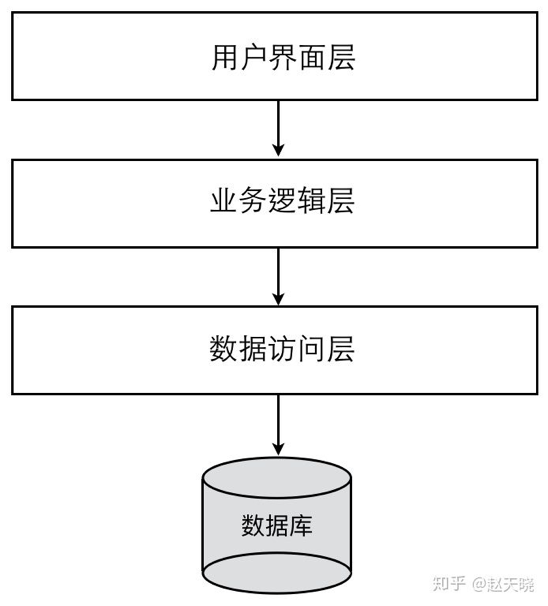
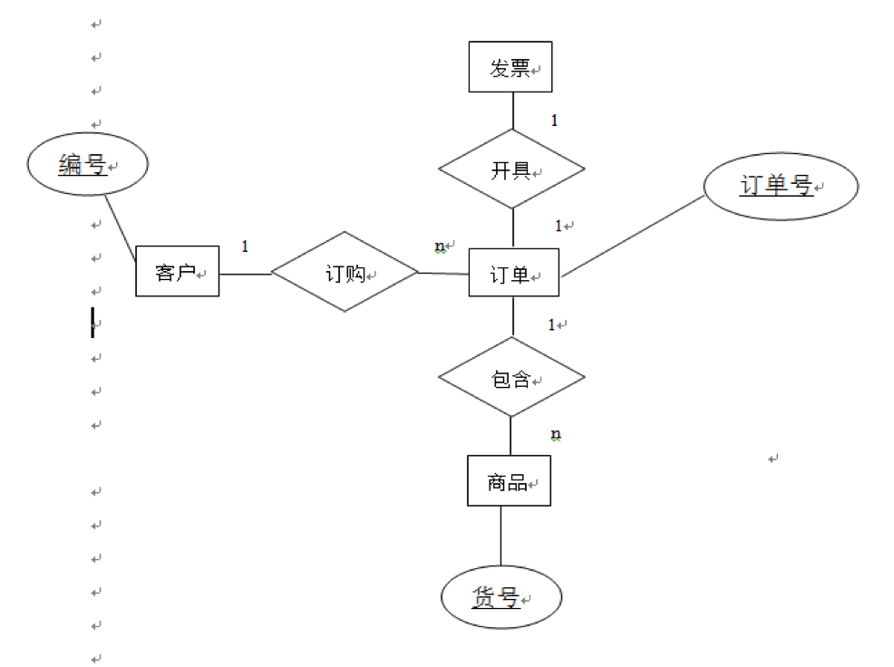
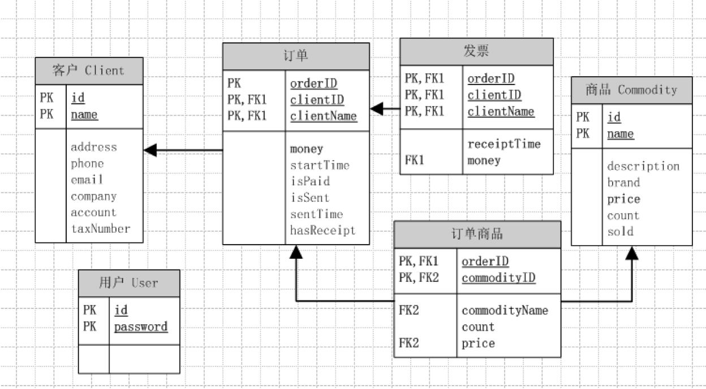
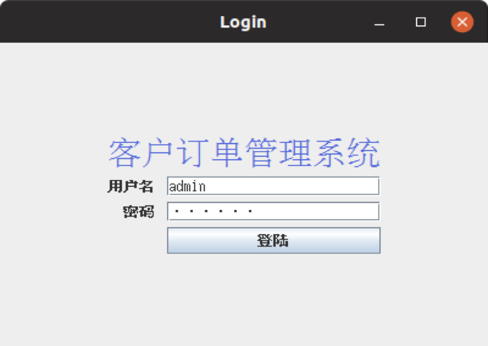
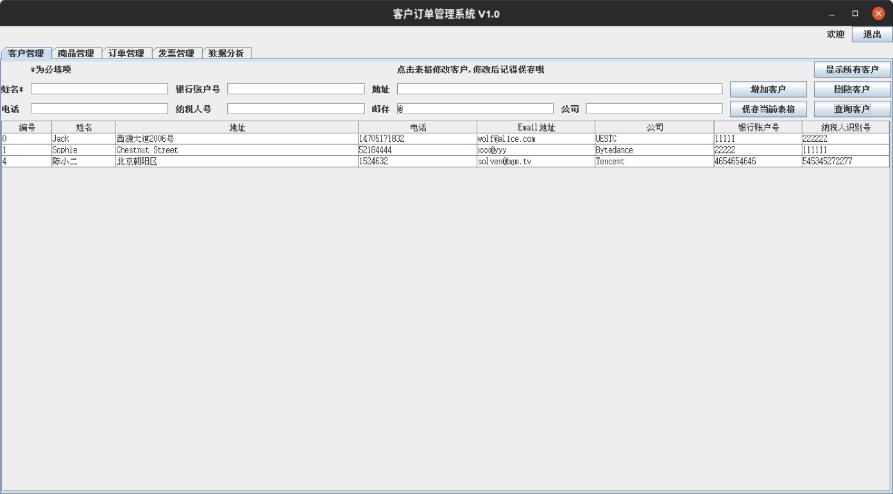
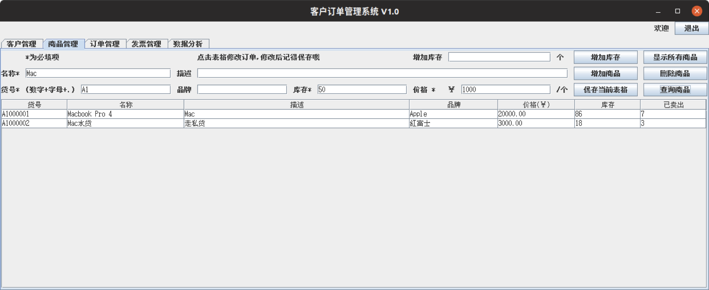
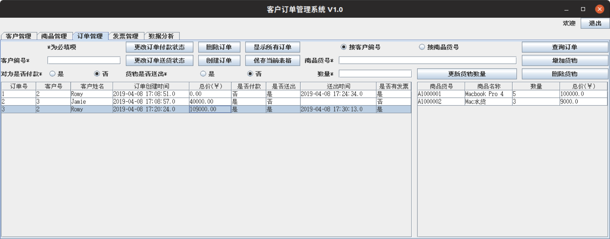
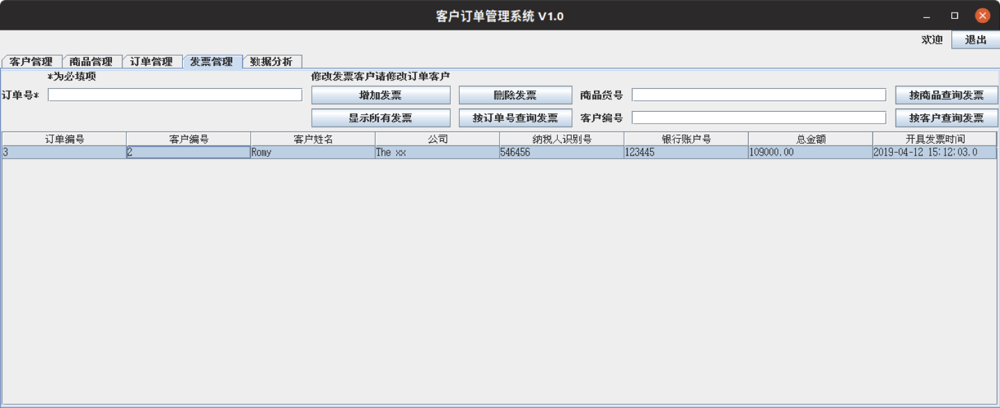
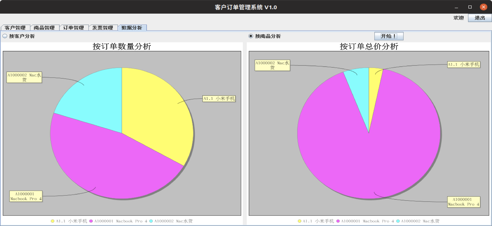

# 电子科技大学计算机学院 综合课程设计

设计并编码实现客户订购管理软件

客户管理模块：增删改查客户信息

订单管理模块：增删改查订单信息

发票管理模块：增删改查发票信息

货物管理模块：增删改查货物信息

统计分析模块：按照客户、货物统计分析订单数量和金额。

## 1. 系统的整体架构

分为三层，从下至上分别为：数据访问层、业务逻辑层、表示层。

 1：数据访问层:对原始数据进行操作，为业务逻辑层或表示层提供数据服务. 

2：业务逻辑层:主要是针对具体的问题的操作，也可以理解成对数据层的操作,对数据业务逻辑处理。

 3：表示层: 主要提供界面渲染等表层功能。

## 2. 系统的数据模型

## 3. 系统的界面设计

